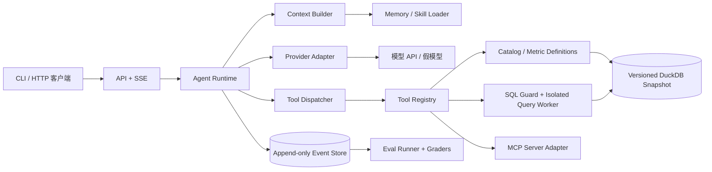

# 可信运营数据分析 Agent：设计规划

版本：0.1（2026-09-24）

## 1. 设计原则

1. **证据优先**：答案中的数值来自受控查询；数据字典提供口径；系统把“观察”与“推断”分别标注。
2. **事件为事实来源**：不可变的事件日志保留原始 Trace；RunState 是事件折叠得到的当前视图。压缩只影响模型输入。
3. **确定性外壳、可替换模型**：模型决定下一步的分析动作，程序负责权限、预算、工具校验、事件顺序和停止规则。
4. **工具先本地，MCP 后适配**：工具业务逻辑与传输协议分离，避免两个入口产生不同的安全策略。
5. **先闭环再增强**：以 10 题金标验证最小 loop，然后逐步加入隔离、记忆、skills 和大规模评测。

## 2. 系统结构



建议目录边界（实现时可调整，须在 `teach_me.md` 解释）：

```text
src/trustworthy_data_agent/
  domain/       # 事件、状态、工具与证据类型
  runtime/      # loop、上下文、模型适配、事件持久化、调度
  data/         # 数据快照、目录/指标、SQL 策略及执行进程
  tools/        # 本地工具注册、schema、结果规范化
  interfaces/   # CLI、FastAPI SSE、MCP 适配
  eval/         # 任务、trial、评分器与报告
tests/
docs/
data/           # 小样本或生成脚本；大数据不直接提交
```

## 3. Agent 状态与事件

`RunState` 至少包含 `run_id`、会话 ID、用户问题、轮次、状态、预算（轮次、工具、token、费用、墙钟时间）、活动工具调用、已注入记忆/技能引用、对话与证据引用、终止原因。状态值建议 `created/running/waiting_tool/completed/failed/cancelled/budget_exceeded`。

每个 `AgentEvent` 包含 `run_id`、单调序列号 `seq`、`turn_id`、事件类型、UTC 时间、可序列化载荷及关联 ID。事件类别包括 `run_started`、`loop_started`、`context_built`、`model_started`、`text_delta`、`tool_call_delta`、`tool_call_ready`、`tool_started`、`tool_finished`、`tool_failed`、`memory_ready`、`context_compacted`、`run_completed`、`run_failed`、`run_cancelled`。模型增量可批量写入以控制日志量，但最终模型消息和工具参数必须完整保存。

Trace 采用 `run → turn → model/tool/query` 层级的 span，记录耗时和错误。OpenTelemetry 的 `trace_id/span_id` 约定可用于跨 API、运行时、查询进程关联；事件日志仍是业务审计的事实来源。SSE 的 `id` 对应持久化 `seq`，为重连续传提供基础。

### 3.1 状态转移与崩溃恢复

每次外部动作先记录意图事件，完成后记录结果事件。启动时将事件折叠为状态；若发现已发起但没有完成的模型/工具动作，依据动作是否可安全重试和调用 ID 去重处理，不能凭空宣布成功。只读工具允许有限重试；模型重试需记下可能多计费的事实。事件写入应原子、按单 run 顺序。

## 4. 核心循环

```text
initialize state and trace
emit run_started
while not terminal:
    emit loop_started
    collect completed asynchronous memory extraction from prior turns
    build bounded context view from immutable history + catalog + selected skills/memory
    emit context_built (include hashes and included evidence IDs)
    stream model response; persist and yield normalized events
    when a tool call is complete: parse JSON, validate schema/policy/budget
    dispatch independent read-only calls with bounded concurrency
    persist tool results (full result reference + concise model-facing view)
    if final answer: verify claim/evidence links, emit run_completed
    elif recoverable error: attach typed error and continue within budgets
    else: emit explicit terminal failure
```

“边解析工具边执行”在此指**流式接收增量，并在单个工具调用参数完成后尽早派发**，而不是运行不完整 JSON。某些 API 的 `function_call_arguments.done` 只表示参数已完整；仍需确认调用 ID 和供应商的完成/中断语义，不能把部分、取消或不完整响应误认为可执行调用。多工具并行只用于互不依赖的只读调用；结果按调用 ID 关联，下一轮上下文使用确定性顺序。

终止条件：模型给出可核验最终答复；用户取消；超出轮次/工具/token/费用/时间预算；不可恢复的安全或系统错误。可恢复错误包括参数 schema 错误、数据库语法错误、暂时性 API 失败；针对同一错误设重试次数，防止循环。

## 5. 上下文、Memory 与 Skills

`ContextBuilder` 从原始事件生成本轮模型视图：固定指令和用户问题、数据口径、最近交互、必要的工具结果摘要、证据指针、选中的技能/记忆。超过预算时先截断单个过大工具结果并保存全文引用，再归纳旧轮次；摘要必须保留约束、已验证事实、查询 ID、未完成动作。压缩结果单独版本化，失败时可从原始轨迹重新生成。

Memory 仅保存可复用的用户偏好、数据口径或任务事实，记录来源、时间、置信度和有效期；不得将工具输出中的命令写成高优先级指令。异步提取产生 `memory_ready` 事件，**只在下一个 `loop_started` 后纳入上下文**，避免运行中的模型输入突变。首版可实现内存内队列和文件/SQLite 存储；是否加入向量检索由评测收益决定。

Skill 是带名称、用途、版本和内容的按需说明文件。先依据任务选择，再读取相关内容，记录版本与哈希；不预装所有内容。Skill 不可直接突破工具注册和 SQL 权限；来自外部的 Skill/MCP 返回内容视为不可信数据。

## 6. 模型适配与流式协议

`ProviderAdapter` 输出统一事件：文本增量、工具参数增量、完整工具调用、使用量、完成、错误。实现先选一个可用供应商，再用假流回放测试边界；不要把供应商专有响应类型传播到 loop。接口需支持取消和超时。模型密钥只从环境读取。

API 使用 FastAPI SSE，先持久化再向客户端发送；事件含 `run_id`、`seq`、`type`、`payload`。客户端断线不应使已记录的结果丢失；是否继续后台运行由 API 契约显式规定。`Last-Event-ID` 或等效机制用于读取遗漏事件。CLI 显示同一事件模型，避免业务逻辑重复。

### 6.1 当前实现的暂定文本契约

每次模型请求有独立 `attempt_id`。`text_delta` 携带 `provisional=true`，只表示尚未通过完成与证据门禁的草稿；客户端应按 `attempt_id` 缓冲，不能当最终答复。成功时 `text_committed` 提供权威全文，随后 `run_completed` 的 `answer` 和 `attempt_id` 必须一致。模型流异常、工具轮次、token 超限或答案被拒时，以 `text_discarded` 清掉该尝试的草稿。SSE 保留暂定增量供可撤销界面使用；终端只显示提交后的全文，工具进度仍可实时显示。断线重放应按事件序号重新应用这些转移，不把被丢弃的草稿留在界面。评分器 v6 检查暂定文本都有关闭事件且提交文本等于最终答案；旧 Trace 没有该协议字段时仍可独立重评。

### 6.2 当前实现的分层上下文

当前上下文先尝试完整视图；字符预算不足时，仅对较早的 SQL 工具结果生成紧凑模型视图，保留查询 ID、数据版本、结果哈希、SQL、列与前三行，最近两个工具结果保持完整。若仍超额，则按完整工具调用批次边界摘要更旧的对话，并保留旧查询 ID 指针。`RunState.history` 与事件日志中的原始结果不删改；`context_layered` 和 `context_compacted` 分别记录两层动作。若最近必须保留的消息自身超额，终止为预算失败，不向模型发送超限上下文。预算目前按 JSON 字符数近似，不能当作供应商 tokenizer 的精确窗口；摘要模型的用量尚未计入主循环 token 上限。

## 7. 工具与 SQL 安全边界

本地工具：`catalog_list_tables`、`catalog_get_metric`、`data_preview`、`sql_query`（具体名称可按实现固定）。每个工具登记输入 schema、输出 schema、只读属性、最大结果大小、超时、允许并发性。Tool Dispatcher 在执行前按顺序检查：调用完整性 → JSON/schema → 工具白名单 → 运行预算 → SQL 策略 → 查询执行。工具错误以结构化代码返回模型并写入 Trace。

**不可信 SQL 应按代码看待。** 只读数据库连接和关键字正则不是沙箱。建议使用 SQL AST 仅允许单条 SELECT/受限 WITH、批准的表/列与函数；拒绝文件和网络读取函数、系统表、DDL/DML、附加数据库、扩展、PRAGMA/SET、多语句及不明语法。数据库连接设 `READ_ONLY`、关闭外部访问与扩展自动装载，并在权限受限的子进程或容器运行；限制线程、内存、临时空间、超时、输出行数和并发。数据先导入固定 DuckDB 文件，再关闭外部访问，避免查询时读 Parquet 文件。所有拒绝案例写为回归测试。

结果返回前保存规范化的查询、数据版本、行数、列、有限样本、完整结果哈希和 `query_id`。模型只看到必要摘要；用户可通过查询 ID 查看可公开的 SQL 与结果摘要。对“原因”类问题，Agent 必须比较样本量、异常值及分组贡献，并说明无法证明的因果关系。

## 8. MCP 适配

MCP server 只包装已注册的只读工具，不复制数据访问逻辑；调用返回结构化数据、错误类别及证据 ID。项目应固定 SDK/协议版本、保留互操作测试。MCP 2026-07-28 版本改为无会话协议，若目标客户端仍使用旧版本，则由 SDK 协商兼容，项目文档需写清实际测试版本。工具标注 `readOnlyHint` 等只作提示，不取代本地强制校验。

## 9. 评测设计

冻结数据哈希、口径版本、评测题和预期结果。每题包含任务类别、允许的口径、结果断言、必要证据/安全断言。单轮基线使用相同模型、数据和预算，输出一次 SQL/答复；Agent 运行在相同快照上。区分开发集和留出集，每题运行多个 trial；评分由确定性 SQL 结果断言、结构化事件断言为主，主观文字评估作为补充且需人工校准。

报告展示：完成率、结果正确率、证据覆盖率、安全拒绝率、延迟、token/费用、方差及失败案例。不得把“生成了 SQL”计为任务完成。所有实验记录模型标识、参数、提示词版本、代码提交、日期和异常情况。

## 10. 分阶段开发与风险控制

详细里程碑见 `requirements.md`。每一步先做可运行验收，再扩展边界能力。关键风险与对应测试：

| 风险 | 应对与测试 |
| --- | --- |
| 部分工具 JSON 被误执行 | 假模型逐字符流、取消流、无完成事件测试；执行计数必须为零。 |
| 压缩删除证据 | 压缩前后事件数与查询引用一致；从事件重新构建上下文。 |
| 迟到的 Memory 产生竞态 | 在模型流中完成提取，断言只在下一轮上下文出现。 |
| SQL 绕过 | `WITH ... INSERT`、文件读取、附加库、多语句、未授权表及超时测试。 |
| 最终回答捏造 | claim→query/result 引用校验，空结果必须明确无法回答。 |
| 流式断线丢事件 | 按 SSE ID 重连并对比持久化序列。 |
| 评测泄漏或虚假提升 | 冻结留出集、固定版本，报告全部试验和失败记录。 |

## 11. 官方参考

- [OpenAI Responses streaming events](https://developers.openai.com/api/docs/guides/streaming-responses)
- [OpenAI Function calling](https://developers.openai.com/api/docs/guides/function-calling)
- [Anthropic: Demystifying evals for AI agents](https://www.anthropic.com/engineering/demystifying-evals-for-ai-agents/)
- [Anthropic: Effective context engineering](https://www.anthropic.com/engineering/effective-context-engineering-for-ai-agents)
- [DuckDB: Securing DuckDB](https://duckdb.org/docs/current/operations_manual/securing_duckdb/overview)
- [OpenTelemetry: Traces](https://opentelemetry.io/docs/concepts/signals/traces/)
- [MCP 2026-07-28 版本说明](https://blog.modelcontextprotocol.io/posts/2026-07-28/)

## 12. 当前实现映射与验收状态（2026-09-24）

实际 Python 包为 `src/trust_agent/`，没有沿用第 2 节建议的更深目录层级。`loop.py` 实现状态初始化、循环、事件转发、工具并发与终止；`provider.py` 与 `chat_provider.py` 分别归一化 Responses 和 Chat Completions 流，`config.make_provider` 选择协议；`store.py` 保存和重放 Trace；`context.py` 构建有摘要的模型视图；`memory.py` 处理显式记忆；`tools.py` 注册工具；`sql/service.py` 是查询隔离边界；`api.py`/`cli.py`/`mcp_server.py` 分别负责 HTTP、终端和 MCP；`eval/` 负责 trial、评分、重评与人工决定导入。保留单层包可让面试演示时沿一次请求快速跳转；若今后出现第二种数据库，再按稳定接口拆分。

| 阶段 | 当前状态 | 验证边界 |
| --- | --- | --- |
| P0 | 已完成公开数据快照与 12 条首批题 | 源哈希、行数与金标复核 |
| P1 | 已完成自实现 loop 与追加 Trace | 假模型的多轮、部分 JSON、重放测试 |
| P2 | 已实现 Responses 与 Chat Completions 适配、CLI、FastAPI SSE | 假流/API 测试及兼容网关小样本往返通过；端到端任务表现见下方限制 |
| P3 | 已完成本地 SQL 策略和短生命周期查询进程 | 安全边界测试与真实快照金标通过；未达到生产级 OS 隔离 |
| P4 | 已完成近似字符预算压缩、显式记忆、按需 Skill | 离线测试通过；未实现 tokenizer 精确预算或语义记忆检索 |
| P5 | 已完成共用 ToolRegistry 的 MCP stdio 适配 | SDK 客户端真实往返及 Codex MCP 列表验证 |
| P6 | 已完成 92 题资产、72/20 拆分、基线与 Agent 评测入口、逐 trial 检查点 | 79/79 数值金标复核；修复版开发集与冻结留出集各 3 次、两种路径共 552 trial 完成，人工最终答复评分待完成 |
| P7 | 已完成 README 和三条离线轨迹 | 脚本化假模型演示；简历效果数字须待真实 trial |

`EventStore.replay` 现在优先于快照重建状态；显式以同一 `run_id` 恢复时，可补执行未入日志的只读工具调用，已入日志的结果不会重执行。SSE 能按序列号续传；服务重启仍不会自动重新发起正在进行中的模型请求。最终答案门禁要求真实查询引用，或不含数值结论的拒答；它不做完整自然语言事实校验，人工 rubric 仍必要。记忆按 run 隔离，尚无跨用户身份与权限体系。项目适合本地展示 Agent 工程方法，不能直接作为多用户生产服务部署。

### 12.1 Chat Completions 适配（2026-09-24）

`config.make_provider` 在 `responses` 与 `chat_completions` 间选择，Agent、基线和 CLI/API 共用。`chat_provider.py` 将本项目的 Responses 形态历史转换为 Chat 的 `system/user/assistant(tool_calls)/tool` 消息，多个同轮函数调用合成一条 assistant 消息。流式解析按 `tool_call.index` 聚合 `id/name/arguments`；只有整轮正常结束且全部参数可解析为 JSON 对象后才发 `tool_ready`。Chat 协议没有逐个输出项完成事件，因此这个适配器不能像 Responses 一样在仍在接收整轮流时执行工具。`ContextBuilder` 只在所有工具结果都已配齐的边界压缩，避免产生孤立的 `role=tool` 消息。

兼容网关探针实际返回工具调用、SSE 片段和用量；它把工具轮标为 `finish_reason=stop`，因此不能只把标准的 `tool_calls` 停止原因视为成功。请求的 `Qwen3.5-Turbo` 在实测响应中标为 `Qwen3.5-0.8B`；评测报告分别记录请求与实际型号。一次 Q01 基线和 Agent trial、一次 Q10 Agent trial 都未通过，说明协议打通不等于模型能完成数据分析。三个样本不足以推断总体表现，完整评测应使用确认后的模型与预算。

### 12.2 五题开发集试测、可重评评分器（2026-09-24）

另一兼容网关上的 `qwen3.8-max` 与 `qwen3.8-flash` 各在 Q01/Q02/Q04/Q05/Q10 上运行过一次基线和一次 Agent。Max Agent 原报告暴露评分器假阴性：Q04 列顺序、显示精度与金标不同但值一致；Q05 提供原始分子分母，由回答计算百分比。`eval/scoring.py` 对可判定的列排列允许重排，保留精度容差；分子分母或额外行只能升级为 `needs_review`，不自动算 pass。`eval/review.py` 能从 EventStore 读取已保存 Trace 重新评分，保留原延迟；人工决定导入必须填写 trial 标识、审核人、pass/fail 和具体理由。

旧版评分器把 Max Agent 的五条 Trace 重评为 2 pass、0 fail、3 needs_review，5/5 Trace 检查通过。两条自动 pass 仅证明 SQL 查询值匹配；新版将 SQL 匹配的任务状态也列为 `needs_review`，等待核对最终文字。五题暂无人工任务完成判定；Flash 仍是旧评分器的初始报告，不能据此做同口径准确率对比。`model_failed` 事件也记录流截断等失败时已产生的 token 用量，避免失败 trial 从成本统计中消失。`qwen3.8-max-0902` 的 Q01 单轮基线探针通过，实际模型名与请求一致。正式结果要在固定模型版本和评分器后运行留出集，再完成文字 rubric；本节数字不能作为简历中的整体性能结论。

### 12.3 逐 trial 检查点（2026-09-24）

`eval/runner.py` 的 `TrialJournal` 为长批次写追加 JSONL：实验元数据头固定题集与重复序号、模型和配置哈希、**源码内容 SHA-256**、数据文件身份及 Agent 预算/Trace 路径；每完成一个 trial 即写 score，基线还写 prediction，然后刷盘。`baseline|agent --checkpoint` 新建日志，`--resume` 仅在元数据完全一致时读取已有 trial 并继续；Agent 恢复时还验证对应 Trace 存在。单 trial 在写入前中断可能留下孤立 Trace，恢复会重新运行它。该机制保障评测批次进度，与显式按 run ID 恢复 Agent 会话是不同层级。

### 12.4 冻结版真实评测与发布边界（2026-09-24）

源码指纹、题集、模型设置和数据快照固定后，72 题开发集与 20 题留出集分别对 Agent、同模型单轮 Text-to-SQL 基线各重复 3 次，共 552 次 trial。四组原始报告都能从持久化 Agent Trace 或基线预测无模型重评，核心分数与汇总逐项一致。留出集数值题 Agent SQL 直接匹配/不匹配/待审为 38/4/9，基线为 33/18/0；Agent 另有 3 次无合格完成 Trace。该结果只支持有分母的 SQL oracle 与成本分析。行为题和所有最终文字尚未人工审核，任务完成率不能从 SQL 匹配数推算。原始报告、失败和审核队列索引见 [`live_eval_report.md`](live_eval_report.md)。
